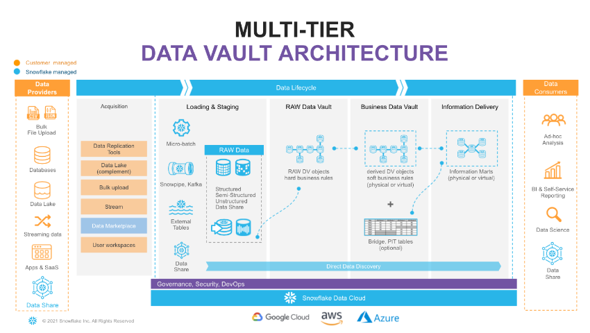
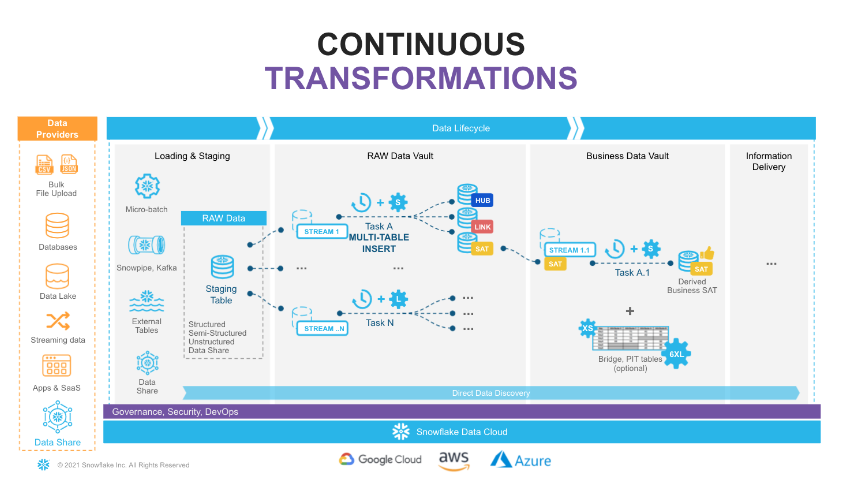
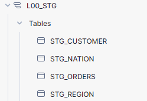
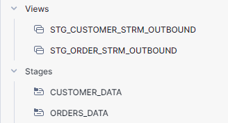
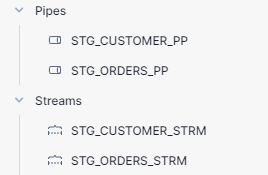

# Project Overview

In the modern data-driven landscape, businesses are transitioning from batch processing to real-time (RT) or near-real-time (NRT) data loading to gain competitive advantages through faster insights. The Data Vault 2.0 architecture, originally designed to accommodate batch data loading, now supports RT/NRT data integration seamlessly, proving its long-term value and adaptability.

This project demonstrates how to implement a real-time Data Vault on Snowflake, leveraging its robust features designed for streaming data. We'll walk through setting up a complete Data Vault environment, including data modeling, the construction of data pipelines using Snowflake's Snowpipe and Continuous Data Pipelines, and applying data virtualization to enhance data access.

## What is Data Vault?

Data Vault is a modern data modeling methodology specifically designed for data warehousing. It was developed by Dan Linstedt in the early 2000s. The architecture is highly flexible, scalable, and adaptable, making it ideal for handling large volumes of data from various sources. Data Vault is particularly well-suited for enterprises that require historical data storage, audit trails, and the ability to quickly integrate new data sources.

### Key Components of Data Vault

Data Vault modeling consists of three primary types of entities:

1. **Hubs**: These are the core entities in a Data Vault model, representing business keys. Hubs help in managing business keys and ensuring that the data model remains robust against changes in business processes.

2. **Links**: Links are used to establish relationships between Hubs or other Links. They are essential for building the network of relationships within the Data Vault and for maintaining the integrity and history of interconnected data.

3. **Satellites**: Satellites store the descriptive attributes related to Hubs and Links, capturing the context of business keys and relationships at various points in time. They allow for the storage of historical changes and provide a rich, time-variant context for the data stored in Hubs and Links.

## Data Vault Architecture

The data lifecycle is split into the following layers:

1. **Data Acquisition**: Data is extracted from source systems and made accessible to Snowflake.
2. **Loading & Staging**: Data is moved into Snowflake and optimized for efficient query access, maintaining its original format. This layer also involves adding technical metadata and calculating business keys.
3. **Raw Data Vault**: Stores data with no soft business rules applied, only immutable rules, to ensure the data remains as received.
4. **Business Data Vault**: Enhances the raw data with soft business rules, including potentially calculated satellites and mastered records, optimizing for business intelligence.
5. **Information Delivery**: Delivers data through consumer-oriented models, such as dimensional models or denormalized tables, tailored to the needs of end-users and supported by Snowflake’s scalable architecture.

## Environment Setup

For demonstration purposes, we use the `ACCOUNTADMIN` role, although in real-world scenarios, a robust Role-Based Access Control (RBAC) model would typically be implemented.

### Virtual Warehouses

We will create two Snowflake virtual warehouses:

1. **dv_lab_wh**: A generic warehouse used throughout this lab.
2. **dv_rdv_wh**: Dedicated to our data pipelines, specifically for Raw Data Vault objects.

Additional virtual warehouses for Business Data Vault and Information Delivery are outlined in the SQL script but are commented out to simplify the initial setup.

### Configuration Overview

The provided SQL script configures the Snowflake environment to support this project by:

- Assigning the highest privilege role to ensure all operations can be performed.
- Creating a new database and setting it as the active database for operations.
- Establishing virtual warehouses optimized for different stages of data processing.
- Defining multiple schemas to organize data at various stages of the Data Vault lifecycle, from staging to information delivery.

This configuration ensures a structured and scalable environment tailored to efficiently manage and process data.

For the full SQL script and detailed configuration steps, please refer to the [Environment Setup](sql/environment_setup.sql) in the `SQL` folder of this repository.

## Deigning Data Pipelines

In this project, we leverage Snowflake's capabilities to create efficient and scalable data pipelines for near-real-time (NRT) data integration. This includes the use of Continuous Data Pipelines and Snowpipe for continuous data loading.
 

### Overview of the Data Pipeline Design

Snowflake provides powerful tools like streams, tasks, and Snowpipe to automate and manage data flows:

- **Streams**: These automatically track all changes to a table (inserts, updates, deletes) without impacting performance. Any new data added to a staging table is immediately captured as a 'delta', showing the changes that need processing.

- **Snowpipe**: Snowpipe is used for continuous, automated loading of data into Snowflake, ensuring that data is quickly available for processing and analysis without manual intervention.

- **Tasks**: Tasks are triggered at defined intervals (e.g., every 1-2 minutes) to check for new data in streams and then execute SQL commands to move this data to the appropriate Raw Data Vault objects. They can be organized into a dependency graph, ensuring sequential processing where necessary.

- **Multi-Table Insert (MTI)**: We use MTI within tasks to simultaneously populate multiple Data Vault objects from a single command, enhancing efficiency and parallel processing.

### Scalability and Serverless Options

The tasks are assigned to virtual warehouses that scale automatically, from XS to 6XL, to handle various data volumes and ensure optimal performance. Snowflake's recent innovation, serverless tasks, allows for an even more efficient management of compute resources, although this feature is beyond the scope of this guide.

### Continuous and Automated Data Flow

Using these tools, our data pipeline continuously updates the Raw Data Vault, and subsequent updates are propagated through to Business Vault objects and beyond. This efficient, incremental data processing ensures data is quickly available for end-use, supporting dynamic business needs with minimal latency.

This architecture provides a robust framework for handling large volumes of data efficiently, maintaining the agility and responsiveness crucial for modern data-driven enterprises.

## 📊 Sample Data & Staging Area Setup

This section outlines the setup process for staging data in Snowflake using sample datasets. We utilize Snowflake's structured querying capabilities to create and manage tables and automate data loading through Snowpipe.

### Setting Up the Staging Area

1. **Role and Warehouse Configuration**
   - Use the `ACCOUNTADMIN` role for highest level privileges.
   - Set `dv_lab_wh` as the active warehouse for processing.

2. **Schema Preparation**
   - Switch to the `L00_stg` schema dedicated to staging operations.

3. **Table Creation**
   - **stg_nation** and **stg_region**: Created to store static reference data from Snowflake's sample datasets.
   - **stg_customer** and **stg_orders**: Structured to ingest dynamic data, with fields for JSON and CSV payloads, respectively, along with metadata like filenames and load timestamps.

### Data Streams and Tasks

- **Streams**: 
  - `stg_customer_strm` and `stg_orders_strm` are set up on the respective tables to monitor and capture data modifications.
  
- **Stages**:
  - `customer_data` and `orders_data` stages are created to manage the data files in JSON and CSV formats, ensuring that data is ready for ingestion.

### Snowpipe for Automated Data Loading

- **Snowpipe Configuration**:
  - `stg_orders_pp` and `stg_customer_pp` are configured to load data incrementally from the stages to the staging tables using the COPY command. This setup enables near real-time data availability in the staging area.

### Data Unloading and Validation

- Data is extracted from the TPCH sample dataset and loaded into the designated stages.
- Validate the data upload by listing files in the stages and querying metadata.

### Business Key Derivation

- Views `stg_customer_strm_outbound` and `stg_order_strm_outbound` are created to parse and transform streamed data into structured formats, deriving business keys using Snowflake’s hashing functions. These views facilitate the extraction of meaningful insights and ensure data readiness for entry into the Data Vault.

### Final Setup and Data Integrity Checks

- Manual triggers refresh the Snowpipe processes to ensure all new data is loaded.
- Validate the integrity and count of the data across tables and streams to ensure consistency and completeness.

### Snowflake Stage Layer

  
  
  

### Code Accessibility

- All SQL commands and scripts used in this setup are available in the `[SQL folder](SQL/setup_staging.sql)` of this repository for detailed review and replication in similar environments.

This setup exemplifies a robust approach to data staging in Snowflake, leveraging the platform's advanced data management capabilities to prepare data for further processing and analysis in a Data Vault architecture.
